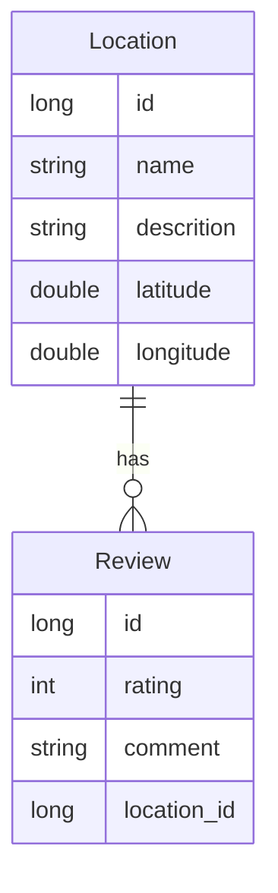

# Projet JEE/Spring I - Rapport

Ce projet à été réalisé par Arnaud Maître, étudiant à la Haute Ecole Arc, dans le cadre du cours JEE/Spring I de 3ème année.

## Sujet

Parmi les différent sujets, le numéro 3 m'a été attribué: points d'intérêt touristiques.

## Fonctionnalités demandées

- En tant qu'utilisateur je veux pouvoir soumettre des lieux identifiées par un nom, une description et la position GPS qui représente un intérêt touristique

- En tant qu'utilisateur je veux pouvoir consulter les lieux soumis par les autres utilisateurs et vote et évaluer un lieux (note)

- En tant qu'administrateur je veux pouvoir valider (publication) un lieux soumis par un utilisateur ou le refuser (n'apparait pas sur la plateforme)

La gestion des utilisateur ayant été retirée du programme du cours, tout ce qui y est lié n'a pas été implémenté.

## Conception

L'application a été découpée en trois couches :

- Repository : Défini les méthodes d'accès à la base de donnée

- Service : Niveau d'abstraction sur Repository permettant de ne pas se préoccuper de la façon dont les données sont stockées dans la couche suivante

- Controller : Défini les endpoints de l'api, appelle les méthodes de Service

## Schéma de base de données



## Modèles/entitées

Deux modèles ont été créés, Location et Review.

Ces derniers ont des champs très similaires à ceux dans la base de données à quelques exceptions près :

- Location contient une liste des Review qui y sont liées

- Review contient un objet Location au lieu de son id

## Problèmes rencontrés - solutions

### Serialization - récursion infinie

Lors de la sérialisation d'un objet Location ou Review, une récursion infine avait lieu : la Location était sérialisée, y compris ses Review, qui contenaient à nouveau la Location.

Solutions envisagées :

- Empêcher la sérialisation des champs problématiques grâce au décorateur `@JsonIgnore`

- Création de models différents pour la couche Repository et les suivantes, en ne stockant que l'id de la clé étrangère dans le model devant être sérialisé

- Ajout des décorateurs `@JsonIdentityInfo()` aux classes model et `@JsonIdentityReference` aux champs problématiques

La 3ème solution a été retenue

## Installation

```bash
git clone https://github.com/Arnaud-Maitre/ProjetJEESpringI.git

cd ProjetJEESpringI

./mvnw clean install

./mvnw spring-boot:run
```

## Utilisation

Commandes curl pour accéder aux différents endpoints de l'api :

### Location

#### Create

```bash
curl -w '\nHttp code: %{http_code}' -H "Content-type: application/json" -d '{"name":"Tour du fantatstique","description":"Anciennes prisons, converties en exposition et musee interractif","longitude":46.99113266985044,"latitude":6.9258106359217235}' localhost:8080/location
```

#### Read

```bash
curl -w '\nHttp code: %{http_code}' localhost:8080/location
```

```bash
curl -w '\nHttp code: %{http_code}' localhost:8080/location/1
```

#### Update

```bash
curl -w '\nHttp code: %{http_code}' -H "Content-type: application/json" -d '{"name":"Test","description":"Un lieu de test","longitude":46.997477,"latitude":6.938519}' -X PUT localhost:8080/location/1
```

#### Delete

```bash
curl -w '\nHttp code: %{http_code}' -X DELETE localhost:8080/location/1
```

### Rating

#### Create

```bash
curl -w '\nHttp code: %{http_code}' -H "Content-type: application/json" -d '{"rating":5,"comment":"Wow","location":{"id":1}}' localhost:8080/review
```

#### Read

```bash
curl -w '\nHttp code: %{http_code}' localhost:8080/review
```

```bash
curl -w '\nHttp code: %{http_code}' localhost:8080/review/1
```

#### Update

```bash
curl -w '\nHttp code: %{http_code}' -H "Content-type: application/json" -d '{"rating":1,"comment":"Nul","location":{"id":1}}' -X PUT localhost:8080/review/1
```

#### Delete

```bash
curl -w '\nHttp code: %{http_code}' -X DELETE localhost:8080/review/1
```
